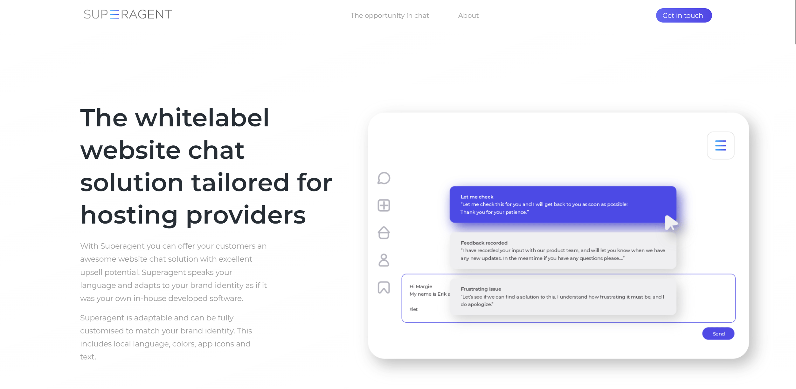
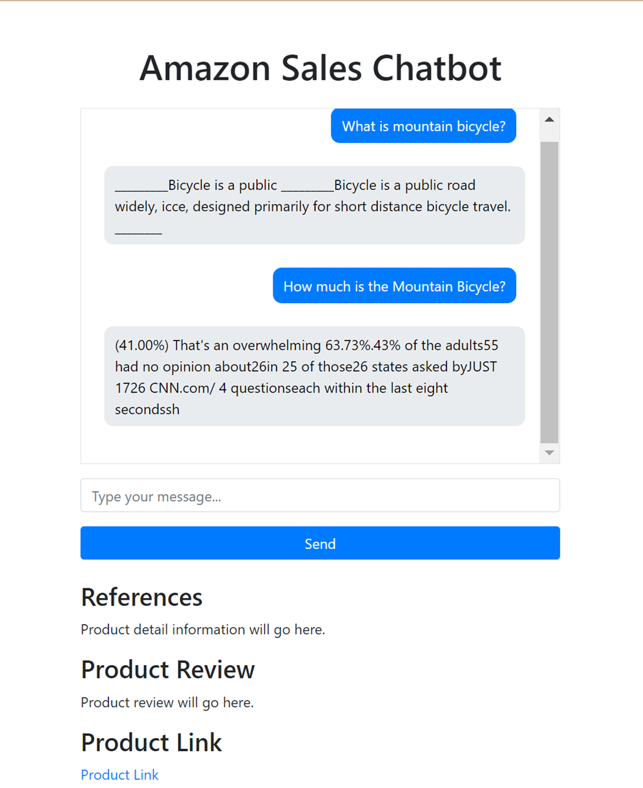

# NLP-Project : Sales Chatbot for Amazon

## Introduction to our team
Allow us to introduce the exceptional individuals who form the backbone of our project team:
- Minn Banya                (st124145)
- Wut Yee Aung              (st124377)
- Kyi Thin Nu               (st124087)
- Thamakorn Kiattikaikul    (st124481)
- Noppawee Teeraratchanon   (st124482)

## Project Background

Nowadays, AI has become popular and used in various industries. AI can reduce operational costs, and increase customer satisfaction. Sales chatbot is the best choice to apply in e-commerce business since sales chatbot can assist customers immediately, and give suggestions based on customer preferences. Therefore, we are interested in developing a sales chatbot for Amazon business in order to apply knowledge from NLP class into the real world scenario.

## Problems and Solutions
#### Problems:
- High Operational Costs: Relying solely on human sales representatives can be expensive due to the need for salaries, benefits, and training.
- Limited Availability: Human sales representatives have limited availability, especially outside of regular business hours. Moreover, the company can miss opportunities for sales when a customer visits a website seeking assistance and no response back.
- Delayed Responses: customers might have to wait for a human representative to become available to address their queries, leading to frustration and potential abandonment of the purchase process.
- Differences in human skills: Because each human salesperson has different skills and knowledge, sales stability may be affected. This variability in expertise among sales staff can lead to inconsistent sales performance, making it challenging to maintain a steady level of sales.

#### Solutions:
We should deploy a chatbot for the following reasons:
- Cost Efficiency: Implementing a chatbot reduces operational costs associated with human sales representatives, including salaries, benefits, and training expenses.
- 24/7 Availability: A chatbot provides round-the-clock availability, ensuring that customers receive immediate assistance even outside of regular business hours, thus preventing missed sales opportunities.
- Instant Responses: With a chatbot, customers receive instant responses to their inquiries, eliminating delays and potential frustration during the purchase process.
- Consistent Sales Performance: A chatbot ensures consistent sales interactions regardless of individual salesperson expertise, helping to maintain a steady level of sales.

## Related Works
1. SuperAgent - a customer service chatbot for E-commerce websites.

SuperAgent is a conversational AI platform that offers chatbot solutions for businesses. It provides tools and technologies to create intelligent chatbots capable of interacting with users through natural language processing. SuperAgent's chatbots can be integrated into various platforms such as websites, mobile apps, and messaging applications to automate customer service, sales support, and other interactions. The platform typically offers features like customizable conversation flows, integration with backend systems, analytics, and reporting capabilities to enhance user experience and business efficiency.
One of the main features of SuperAgent is AI. it utilizes LLMs so that Superagent can help users answer their customer requests. Superagent can operate in fully automatic chatbot mode outside of opening hours, or as an Agent Assist to help support staff to be more efficient.

2. AliMe - a dialogue platform based on NLP that enables smart dialogue through various dialogue-enabling clients.

AliMe's comprehensive framework combines rule-based matching, retrieval, and deep learning techniques to power its dialogue system. The architecture is organized into 3 main layers to effectively handle user interactions:

- Intent Recognition: This tier discerns the underlying intentions behind user messages, categorizing them and extracting relevant attributes. These intentions drive subsequent processes, such as domain identification, making this tier crucial for initiating contextual and domain-specific actions.
- Response Generation: For FAQs, AliMe employs knowledge graph queries or retrieval models. These models extract information from a vast pool of data, facilitating accurate answer identification while also minimizing maintenance costs through integration with traditional retrieval methods. Tasks requiring specific actions, such as booking a flight, are addressed through a combination of intention-based matching and deep reinforcement learning models. Chitchat interactions, characterized by casual conversation, leverage a hybrid approach that integrates retrieval and deep learning models. Initially, a retrieval-based model selects responses from a predefined corpus, followed by re-ranking using a Seq2Seq model for more nuanced outputs.
- Deep Learning Practices for Intent Recognition: AliMe employs deep learning models that incorporate textual features and user behaviors to classify intentions effectively. These models leverage both traditional bag-of-words representations and word embeddings to capture contextual nuances. In developing DL-based intention classification systems, AliMe's team experimented with both multi-classification and binary classification models. While the former offers speed, it requires frequent retraining for label additions, whereas the latter, though less efficient, allows for flexible expansion without retraining.

### Gap Between Related Work
The existing research, represented by SuperAgent and AliMe, mainly focuses on conversational AI solutions for customer service and dialogue management across diverse contexts. However, there's a gap when it comes to applying these approaches to sales chatbots, which is the primary focus of our project. Unlike the broader focus on customer support and general dialogue, our project centers on developing a chatbot tailored specifically for driving sales on Amazon platforms. This involves utilizing classification models and Large Language Models (LLMs) to improve the chatbot's ability to understand user intents, offer personalized product recommendations, and ultimately boost sales. Thus, the gap lies in adapting advanced AI techniques to the sales domain, particularly for E-commerce businesses aiming to enhance their sales processes and engage customers effectively through conversational interfaces.

## Solution Requirements
- Natural Language Processing (NLP): Ability to understand and respond to customer inquiries in natural language.
- Faster and more accurate information retrieval
- Preprocessing the database by separating into labeled bins/ vector stores
- Classifier to determine which vector store the LLM should retrieve information from based on user input
- Designing a suitable prompt template
- Instruction tuning the LLM on Amazon QA data
- Experiments carried out to determine the best model for both classifier and LLM
- Adding additional components to the models, such as Active RAG
- Ablation study to determine which components have the most impact
- Web application that can serve as a chat window for the customer

## Architecture of the Solution
- Data Source and Preprocessing
- NLP
    - Classification Part 
        - MLflow will be used to save the models and see the performance of the models (select the best performance model as our best model)
    - Classification Part
        - MLflow will be used to save the models and see the performance of the models (select the best performance model as our best model)
    - LLM Part
        - Database will be split into vector stores
        - MLflow will be used for experiment logging and model integration
        - Instruction tuning tested and included if there is a positive impact on the performance
- Design test cases and evaluations for the system’s performance
- Web Design
    - Flask as backend framework to handle interaction between user requests and model responses
    - HTML as frontend framework for the user interface.
    - MLflow for managing machine learning models including experiment tracking, model versioning, and model serving.
    - GitHub will manage codebase changes while also tracking modifications in application code changes.
    - Flask as backend framework to handle interaction between user requests and model responses.
HTML as frontend framework for the user interface.
MLflow for managing machine learning models including experiment tracking, and model versioning.
GitHub will manage codebase changes while also tracking modifications in application code changes.

## Research Questions:

1. Which parameters affect classification model performance?
2. What are the key factors influencing the perceived usefulness and user satisfaction with our sales chatbot?

## Hypotheses:

1. We hypothesize that complex parameters can lead to good performance for classification models.
2. We hypothesize that key factors to influencing user satisfaction are ability to understand queries and provide relevant answers. Moreover, web interface, and response time also affect customer satisfaction.

 ## Expected Results
 
- Classification model has at least 80% accuracy.
- The chatbot can answer basic queries, and handle irrelevant questions.
- Chatbot responses are related to user queries and can respond within a short time.

## Dataset Information

We will use the dataset from:
- Amazon product dataset (extracted from meta data) - https://huggingface.co/datasets/McAuley-Lab/Amazon-Reviews-2023 
- Train dataset - https://github.com/amazonqa/amazonqa?tab=readme-ov-file

We acknowledge and appreciate the creators and contributors of the dataset for making it available for public use.

## Task Distribution
- Data Collection  - Thamakorn and Kyi
- Modeling	
    - Classification - Noppawee
    - Language Model - Minn
- Web Application - Wut Yee
- Experiment Testing - Thamakorn and Kyi
- Reporting	and Others - Thamakorn and Kyi

## Methodology
### Classification model
We have trained 3 models (biLSTM, CNN, and BERT) on different parameters.
- For dataset, there are 17 classes including:
  - (1) Electronics
  - (2) Home_and_Kitchen
  - (3) Sports_and_Outdoors
  - (4) Tools_and_Home_Improvement
  - (5) Health_and_Personal_Care
  - (6) Automotive
  - (7) Cell_Phones_and_Accessories
  - (8) Patio_Lawn_and_Garden
  - (9) Toys_and_Games                 
  - (10) Office_Products
  - (11) Beauty
  - (12) Pet_Supplies
  - (13) Baby
  - (14) Musical_Instruments
  - (15) Grocery_and_Gourmet_Food
  - (16) Video_Games
  - (17) Clothing_Shoes_and_Jewelry
- For experimental design:
  - We trained those 3 models with small (500 questions per product category) and large dataset (2000 questions per product category) with 17 classes since we saved the model when the validation loss is improved. Therefore, we select the best model with specific parameter based on minimum validation loss.
  - We tried to reduce the number of classes from 17 to 10 classes (class (1)-(10)) to see the trend of improvement. From comparing the result between model on 17 classes (all result figure on https://github.com/minnbanya/NLP-Project/tree/main/question_classification/17class_image) and 10 classes (all result figure on https://github.com/minnbanya/NLP-Project/tree/main/question_classification/10class_image) , we got CNN as our best model based on training time and minimum validation loss.
  - After we got the best model, we trained it with larger dataset (10000 questions per product category) in 10 classes (class (1)-(10)), 9 classes (class (1)-(9)), 7 classes (class (1)-(7)), and 5 classes (class (1)-(5)). 
  	- On 10 classes, the model got 1.413 on validation loss and around 52.9% validation accuracy
	- On 9 classes, the model got 1.349 on validation loss and around 54.5% validation accuracy
    - On 7 classes, the model got 1.136 on validation loss and around 59.8% validation accuracy
    - On 5 classes, the model got 0.986 on validation loss and around 63.1% validation accuracy
  - We selected the CNN with 5 classes as our best model 
- For evaluation, we tested selected model (CNN with 5 classes) with test set and the model got around 61.5% accuracy

 

### Progress on web application

- Chat Interface:
    - Functionality:
        - Allows users to type messages (Type your message...), send them, and receive responses from the chatbot.
        - Messages are displayed in a visually distinct format, with user messages on the right and bot responses on the left.

- Additional Sections:
    - References:
        - Contains detailed information about the product.
    - Product Review:
        - Displays product review content for user reference.
    - Product Link:
        - Provides a link for users to access more detailed product information.

# Paper Summaries: 

## 1. Active Retrieval Augmented Generation

**Authors:** Zhengbao Jiang, Frank F. Xu, Luyu Gao, Zhiqing Sun, Qian Liu,
Jane Dwivedi-Yu, Yiming Yang, Jamie Callan, Graham Neubig

**Link:** https://aclanthology.org/2023.emnlp-main.495/

**Year:** 2023

**Citations:** 104

**Read by:** Minn Banya

FLARE (Forward-Looking Active Retrieval augmented generation) presents a novel approach to text generation by leveraging forward prediction to anticipate upcoming sentences and retrieve pertinent documents for sentence generation. It conducts a comparative analysis between direct retrieval, based on confidence levels, and instructed retrieval, with direct retrieval showing superior performance. The study identifies optimal confidence values for retrieval falling within the range of 40% to 80%. Furthermore, the technique of masking low-probability tokens during direct retrieval using a threshold value, beta, is demonstrated to be more effective than retrieving entire sentences. Overall, FLARE demonstrates considerable potential in enhancing text generation tasks through the incorporation of active retrieval mechanisms, offering a nuanced understanding of the interplay between forward prediction and document retrieval in the generation process

## 2. Lingke: A Fine-grained Multi-turn Chatbot for Customer Service

**Authors:** Pengfei Zhu, Zhuosheng Zhang, Jiangtong Li, Yafang Huang, Hai Zhao

**Link:** https://aclanthology.org/C18-2024/

**Year:** 2018

**Citations:** 51

**Read by:** Minn Banya

Linke aims to improve chatbot performance by following the 6 steps below:

1. Coreference Resolution and Document Separation: Implements `Stanford CoreNLP` for coreference resolution and document segmentation, resulting in a list of sentences (A).

2. Target Sentences Retrieval: Selects k relevant sentences (2 in this study) from sentence collection (A) using `Apache Lucene`.

3. Candidate Responses Generation: Extracts subject-verb-object (SVO) triples from selected sentences using the `ReVerb` framework, generating simple sentences (T). Candidate responses are formed by the union between relevant sentences (E) and simple sentences (T).

Dialogue Manager:

4. Self-matching Attention: Employs GRUs to convert conversation utterances and candidate responses into word embeddings. Self-matching attention strategy filters redundant information.

5. Response Selection: Matches each candidate response with conversation utterances in chronological order, selecting the final response based on accumulated matching score.

6. Chit-chat Response Generation: Utilizes an attention-based seq2seq model to generate conversational responses when user questions are irrelevant to the current database (matching score of lower than 0.3 for all candidate responses).

## 3. Improving the Domain Adaptation of Retrieval Augmented Generation
(RAG) Models for Open Domain Question Answering

**Authors:** Shamane Siriwardhana, Rivindu Weerasekera, Elliott Wen,
Tharindu Kaluarachchi, Rajib Rana, and Suranga Nanayakkara

**Link:** https://aclanthology.org/2023.tacl-1.1/

**Year:** 2023

**Citations:** 38

**Read by:** Thamakorn Kiattikaikul

The paper introduces Retrieval Augment Generation (RAG) which is the process enhanced in Open-Domain Question Answering (ODQA). However, RAG is not optimized for other specific domains since it was trained on Wikipedia-based knowledge. In this paper, authors propose RAG-end2end, an extension to RAG, for domain adaptation in ODQA. It updates all components of the external knowledge base during training and introduces an additional training signal to inject domain-specific knowledge. Unlike RAG, RAG-end2end jointly trains the retriever and generator for the end QA task and domain adaptation. This approach is evaluated on COVID-19, News, and Conversations datasets, showing significant performance improvements over the original RAG model. The proposed RAG-end2end model aims to finetune all components, including the DPR retriever, and dynamically update the external knowledge base during training to facilitate domain-specific question answering. Experiments on these datasets demonstrate significant improvements in performance metrics like exact match, F1, and retrieval accuracy with RAG-end2end compared to RAG-original-QA. Adding the statement-reconstruction task can enhance domain adaptation. RAG-end2end also outperforms standalone Dense Passage Retrieval (DPR) fine tuning with domain-specific data. Initializing RAG with domain-adapted DPR prior to fine tuning yields improvements, but RAG-end2end training still performs better.

## 4. SuperAgent: A Customer Service Chatbot for E-commerce Websites

**Authors:** Lei Cui, Shaohan Huang, Furu Wei, Chuanqi Tan, Chaoqun Duan, and Ming Zhou

**Link:** https://aclanthology.org/P17-4017/

**Year:** 2017

**Citations:** 424

**Read by:** Thamakorn Kiattikaikul

The authors demonstrated SuperAgent, an add-on web browser extension customer service chatbot. The chatbot consists of 3 sub-engines: 1) a fact question answering engine for Product Information; 2) an FAQ search engine for QA; 3) an opinion mining & text question engine in Customer Reviews. The benefits is they don't need to deploy the website, data update easily, and different engines can process parallel (between these 3 engines). The result shows that the chatbot is able to answer specific questions, conduct FAQ search from QA pairs in customer review section, and reply to chit chat conversations.

## 5. Question Classification using Head Words and their Hypernyms

**Authors:** Zhiheng Huang, Marcus Thint, and Zengchang Qin

**Link:** https://aclanthology.org/D08-1097/

**Year:** 2008

**Citations:** 269

**Read by:** Noppawee Teeraratchanon

This paper is about Question Classification to classify the questions and narrow down the search space to identify the correct answer. They used 2 models to compare which are `LIBSVM` and `Stanford Maximum Entropy`. Moreover, they used 5 different features to deal with questions including:
1.	Question wh-word: to separate the question into what, which, when, where, who, how, why, and rest type.
2.	Heas words: to focus on identifying the single word that carries the most meaning or significance Instead of considering the entire question.
3.	WordNet Semantic:
    &nbsp; 3.1 Direct hypernym: use WordNet to assign the broader categories or concepts of words. For example, "animal" is a hypernym of "dog" and "cat."
    &nbsp; 3.2 Indirect hypernym: use WordNet to find the similarity between the head word on such question and the description word in question categories. The question category that has the highest similarity is marked for head word as a feature.
4.	N-gram: to separate the question into chunks. In this paper, they focus on unigram, bigram, and trigram.
5.	Word shape: to classify the tokens into all upper case, all lower case, mixed case, all digits, and other categories.
 
To evaluate, First, the paper tests SVM and ME models with individual features. As a result, the wh-word and head word is the best among individual features. Direct hypernym is better than indirect hypernym. Unigram is also better than bigram and trigram. Next, they evaluate the model with a combined feature from baseline (wh-word and head word), and they can conclude that the linear SVM and ME with wh-word, head word, direct hypernym, unigram, and word shape are the best with 89.2% and 89.0% respectively.

## 6. AliMe Chat: A Sequence to Sequence and Rerank based Chatbot Engine

**Authors:** Minghui Qiu, Feng-Lin Li, Siyu Wang, Xing Gao, Yan Chen, Weipeng Zhao, Haiqing Chen, Jun Huang, Wei Chu

**Link:** https://aclanthology.org/P17-2079/ 

**Year:** 2017

**Citations:** 232

**Read by:** Noppawee Teeraratchanon

The paper is about a chatbot called AliMe Chat that's really good at answering questions and having conversations. It introduced a new method for improving chatbots by combining 3 models including:
1.	Information Retrieval (IR) model is used for retrieving the number of sets of candidate QA pairs from the database that has the top similarity score between the input question and the retrieved question calculated by BM25.
2.	Rerank model (Seq2Seq) is used for calculating the confidence score between the input question and all candidate answers and selecting the answer that has the highest score. If the score is higher than the threshold, the chatbot takes the answer.
3.	Generation based model (Seq2Seq with GRU) is used for generating the answer from scratch based on context if the score from the Rerank model is lower than the threshold.
 
By combining 3 models, it handles the limitations of the IR model (struggle with less common questions and difficulty to handle with long-tail questions) and the Seq2Seq based generation model (sometimes gives inconsistent or nonsensical answers). Moreover, the paper compared IR, Generation, IR + Rerank, and IR + Rerank + Generation. They concluded that IR + Rerank + Generation got the highest accuracy.

## 7. Bot2Vec: Learning Representations of Chatbots

**Authors:** Jonathan Herzig, Tommy Sandbank, Michal Shmueli-Scheuer
David Konopnicki1 John Richards

**Link:** https://aclanthology.org/S19-1009.pdf

**Year:** 2019

**Citations:** 1

**Read by:** Kyi Thin Nu

BOT2VEC is a framework for learning vector representations of conversational bots using neural networks. The framework offers two approaches: content-based (BOT2VEC-C) and structure-based (BOT2VEC-S) representations. Conversations are represented either by textual content or by analyzing the structure of bot graphs. The framework is evaluated on two classification tasks: detecting production bots and identifying egregious conversations. Experimental results demonstrate the effectiveness of BOT2VEC representations in improving classification performance compared to baseline models. Additionally, the analysis reveals semantic similarities between bots within the same domain based on their structure representations.

Keywords: Conversational Bots, Representation Learning, BOT2VEC, Neural Networks, Classification Tasks, GitHub Repository.

## 8. Conversational Recommender System and Large Language Model Are Made for Each Other in E-commerce Pre-sales Dialogue

**Authors:** Yuanxing Liu, Weinan Zhang, Yifan Chen, Yuchi Zhang, Haopeng Bai, Fan Feng, Hengbin Cui, Yongbin Li, Wanxiang Che

**Link:** https://aclanthology.org/2023.findings-emnlp.643/

**Year:** 2023

**Citations:** 106

**Read by:** Kyi Thin Nu

This paper explores the synergistic integration of Conversational Recommender Systems (CRS) and Large Language Models (LLMs) in e-commerce pre-sales dialogues. By combining CRS, which suggest products based on user preferences, with LLMs, capable of generating human-like responses, the system aims to enhance the shopping experience. The study investigates how the joint utilization of these technologies improves recommendation accuracy and user satisfaction. Experimental results demonstrate the effectiveness of the integrated approach in facilitating meaningful and personalized interactions between users and e-commerce platforms, leading to increased engagement and conversion rates.

Keywords: Conversational Recommender System, Large Language Model, E-commerce, Pre-sales Dialogue, Personalization, User Engagement.

## 9. CHAI: A CHatbot AI for Task-Oriented Dialogue with Offline Reinforcement Learning

**Authors:** Siddharth Verma, Justin Fu, Mengjiao Yang, Sergey Levine

**Link:** https://aclanthology.org/2022.naacl-main.332.pdf

**Year:** 2022

**Citations:** 30

**Read by:** Wut Yee Aung

This paper study how offline reinforcement learning can instead be used to train dialogue agents entirely using static datasets collected from human speakers. Their experiments show that recently developed offline RL methods can be combined with language models to yield realistic dialogue agents that better accomplish task goals.

**Methodology:**

- Reinforcement Learning Setup:
    - This study formulate the task-oriented dialogue problem as an RL problem, where the agent serves the role of seller and the environment serves the role as the buyer. It utilizes offline RL, which leverages pre-collected datasets of human conversations.
    - The problem is defined as a Markov decision process, with states, actions, transition distribution, and reward function.
        - States (**S**) include information like action type, utterance content, normalized price related to list price, and context like ad description.
        - Actions (**A**) involve sending messages or offers with proposed prices.
        - Transition Function (**T**) determines how likely different responses are after each action taken by our seller bot.
        - Reward Function (**R**) : Chatbot receives rewards based on how well it negotiates:
            - If it sells an item, it gets points proportional to the selling price (normalized against list price and multiplied by ten).
            - If its offer gets rejected, it loses points (a penalty of -20) to push it toward making successful deals.
    - The RL objective is to find a policy that maximizes the expected returns over time. It can be done either through online RL (interacting with the environment) or offline RL (using pre-collected interactions).
- Offline Reinforcement Learning with Language Models:
    - Proposed approach combines offline RL with fine-tuned language models.
    - The approached begins with training a language model, such as GPT-2 and fine-tuning it on task-specific dialogue corpus.
    - Then train a critic or Q-function which is responsible for scoring good and bad responses and is used to select responses from a pool of candidates generated from the language model. Implement 3 Q-learning framework for training and compare.
        - Proposal Sampling (CHAI-prop)
        - Conservative Q-Learning (CHAI-CQL)
        - Behavior-Regularized Q-Learning (CHAI-BRAC)
- Dialogue Generation from trained Q-function:
    - Finetuned language model is used to generate candidate responses conditioned on the conversation history, along with sampled prices.
    - Each action is scored using a critic.
    - Final response is returned by sampling the Q-value scores.

**Dataset and Evaluation:**
- CraigslistBargain dataset which consists of real dialogues between buyers and sellers on Craigslist.
- CHAI is evaluated on a negotiation scenario using this dataset.
- The seller role is played by CHAI, while the buyer is simulated by the environment.

**Results and Analysis**

- CHAI combines the strengths of two techniques:
    - Offline Reinforcement Learning (RL): allows CHAI to learn from pre-collected datasets of human conversations, making it efficient and avoiding the need for real-time interaction.
    - Language Models (LMs): This enables CHAI to generate natural and grammatically correct language during conversations.
- CHAI gives both descriptive responses to questions and reasonable bargaining behavior, whereas the retrieval-based agent only shows good bargaining behavior, and the language model agent only gives descriptive responses.

## 10. SalesBot: Transitioning from Chit-Chat to Task-Oriented Dialogues

**Authors:** Ssu Chiu,  Maolin Li, Yen-Ting Lin, Yun-Nung Chen

**Link:** https://aclanthology.org/2022.acl-long.425.pdf

**Year:** 2022

**Citations:** 25

**Read by:** Wut Yee Aung

This paper focuses on investigating the conversations starting from open-domain social chatting and then gradually transitioning to task oriented purposes, and releases a large-scale dataset with detailed annotations for encouraging this research direction. To achieve this goal, this paper proposes a framework to automatically generate many dialogues without human involvement, in which any powerful opendomain dialogue generation model can be easily leveraged.

**Background:** Existing dialogue systems are usually categorized into two types: 
- Open-domain : focus on free chatting with users and are not able to complete tasks as human assistants.
- Task-oriented : is designed to complete the users’ goals.
- These two types have been studied separately till this study has released.

**Proposed Approach:** proposed approach introduces SalesBot as a new framework that generates data transitioning from open-domain chit-chats to task-oriented dialogues. This framework consists of 
- Open-Domain Dialogue Generation
    - use BlenderBot as pre-trained generation model open-domain conversations
    - use ParlAI2 software to create two BlenderBots with different personas to generate conversations which cover a wide range of topics.
- Chit-Chat to Task-Oriented Transition : focus on capturing the suitable timing and deciding how to smoothly transition to the target task respectively
    - Task-oriented intent detector to find out the good timing when someone might be interested in the product based on their conversation.
    - Transition turn generator focuses on smoothly switching from casual conversation to talking about the product.
- Task-Oriented Dialogue Generation : generating the conversation after the salesperson has transitioned from chit-chat to talking about the product.
    - Merge SGD: merge appropriate task-oriented dialogue from TOD with a chit-chat dialogue.
    - Task-Oriented Simulation: creates a new conversation from scratch. They train two different AI models, one for the customer and one for the salesperson. These models can have an open-ended conversation until they reach a stopping point.

**Results and Analysis:** The researchers evaluated their generated dialogues using human judges. The results showed the system could produce natural conversations relevant to the initial chat and transition smoothly to sales talk without being overly aggressive. Two methods for generating the sales conversation (Merge SGD and TOD Generation) showed similar performance while one underperformed due to the complexity of detecting implicit intents in chit-chat conversations.

## Acknowledgments

We extend our heartfelt gratitude to our dedicated team for their unwavering support and guidance throughout the project. Their invaluable contributions have been instrumental in the development and testing of this project. We would also like to express our special thanks to Minn, Wut Yee, Kyi, Puay and Noppawee for their exceptional efforts and commitment to ensuring the success of this endeavor.
